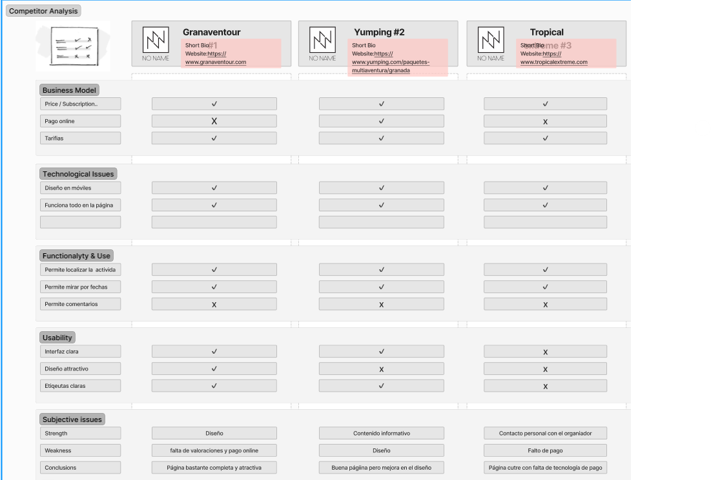
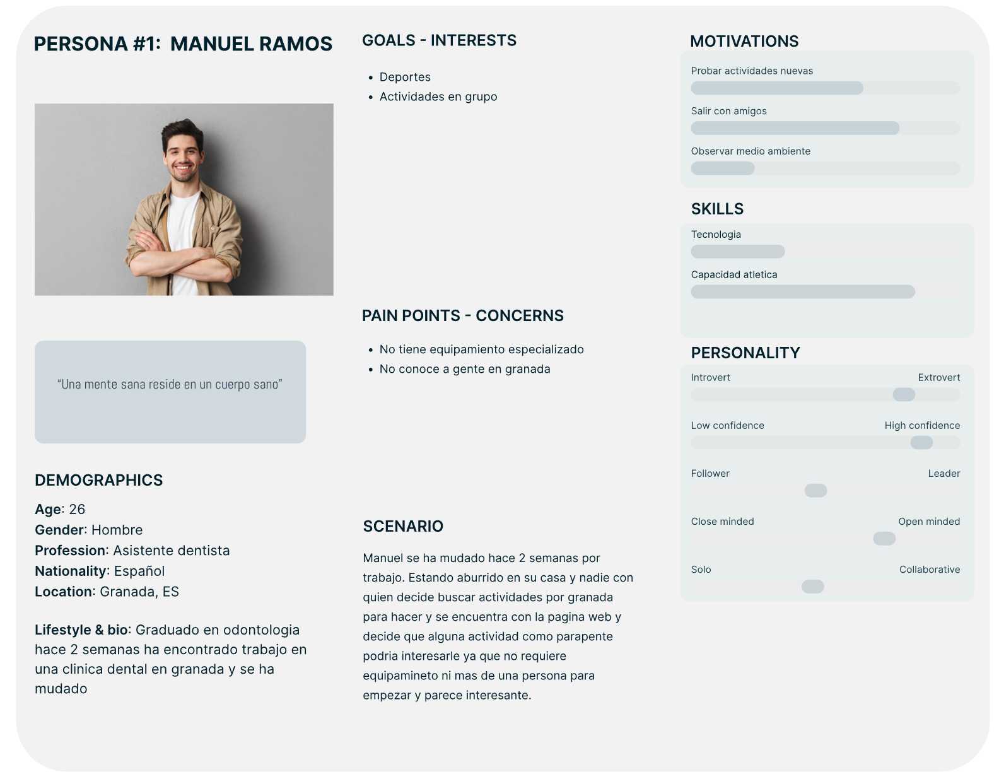
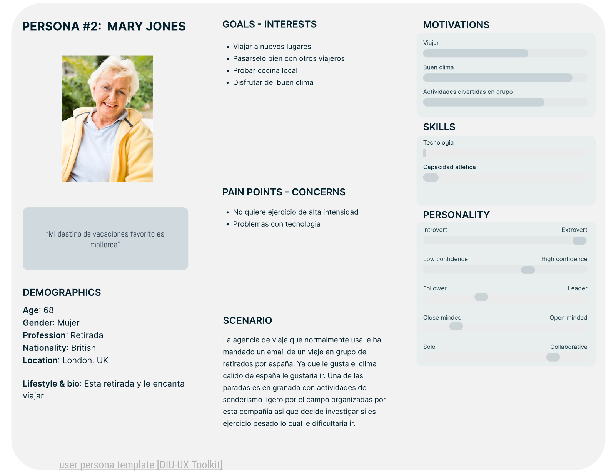
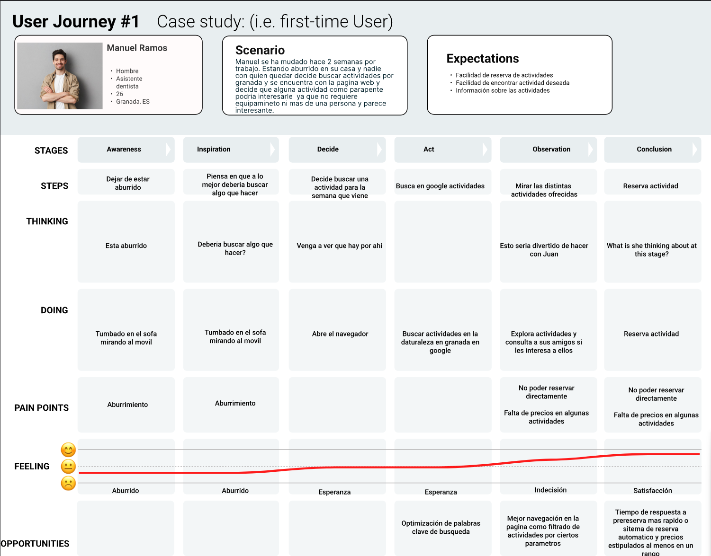
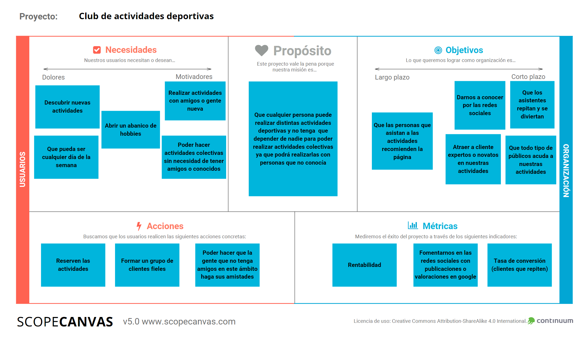
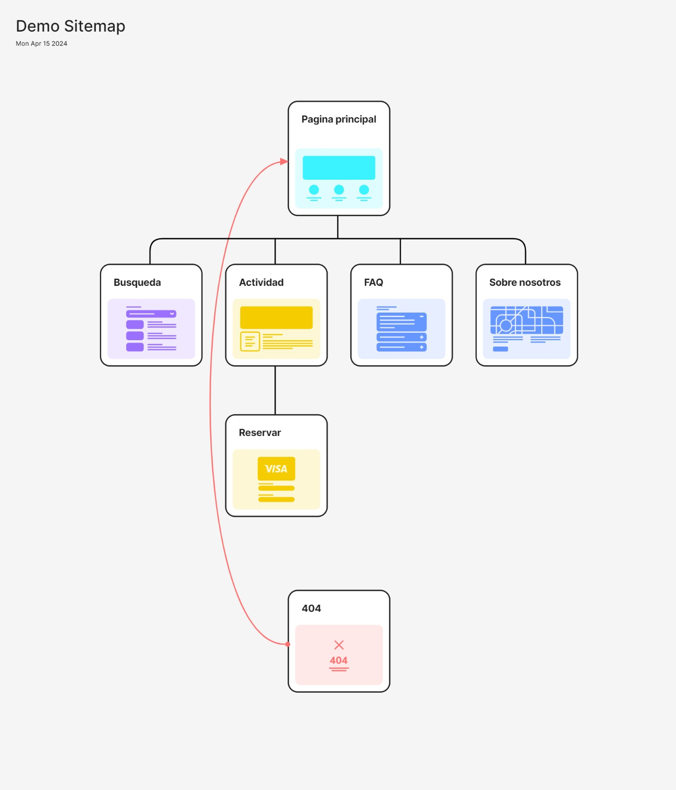
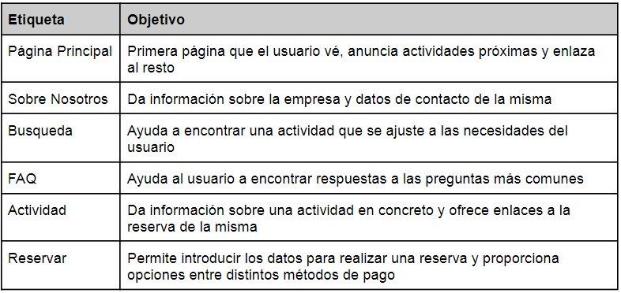
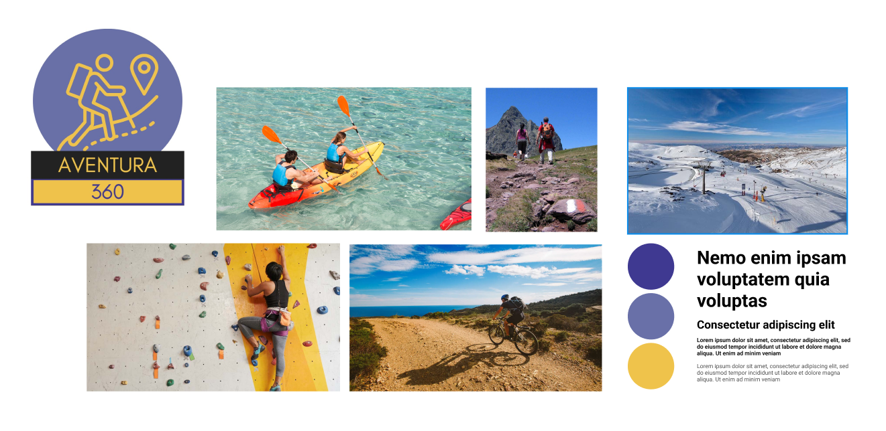
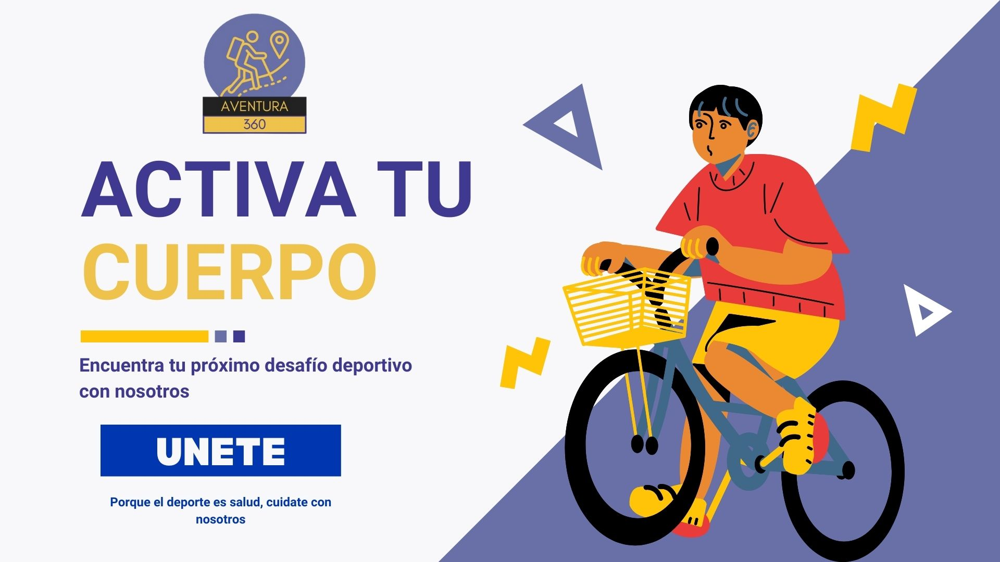

# DIU24
Prácticas Diseño Interfaces de Usuario 2023-24 (Tema: .... ) 

Grupo: DIU3_ASMGLP .  Curso: 2023/24 
Updated: 11/2/2024

Proyecto: 
Aventura360
Descripción: 

Nuestra idea es una página web para poder reservar actividades de aventuras y deportivas de todo tipo y dificultades y para todas las edades, donde puedas hacerlo de forma online y de forma autonoma. Tambien existe la posibilidad de que quieras hacer actividades grupales y no tengas con quien hacerlo, nosotros nos encargamos de ayudarte.

Logotipo: 

Miembros
 * :bust_in_silhouette:   Germán López Pérez     :octocat:     
 * :bust_in_silhouette:   Alberto Siles Molina     :octocat:

----- 

# Proceso de Diseño 

## Paso 1. UX User & Desk Research & Analisis 

 **1.a User Reseach Plan**
-----
[User Reseach Plan ](P1/User Research.pdf)

 1.b Competitive Analysis
-----

Las tres son del mismo ambito, es verdad que unas tienen mejores interfaces que las demás, pero dos de ellas tienen la limitación de no poder reservar de forma autonoma si no esperar a que tengas que hacerlo por teléfono.
Nos quedamos con Granaventur, que pese a tener carencias en algunos ambitos cumplía con varios requisitos.

 1.c Persona
-----
Elegimos a esta persona, debido a que era una persona joven, con ganas de hacer deporte, pero que tenía una limitación al estar sin amigos en la ciudad en la que se mudó.

Esta persona es completamente distinta a la anterior, y la hemos cogido tambien porque es una persona mayor, que tiene dificultados con las tecnologías, tampoco tiene buen físico por lo cuál tiene limitaciones, pero si cuenta con un grupo con el que hacer activadades

 1.d User Journey Map
----

 1.e Usability Review
----
[Usability](/P1/Usability-review.pdf)

Valoración: 55
Comentario: la página tenía mucha falta de automatismo y mecanismos para poder reservar las actividades por cuenta propia. Tambien tenía una limitación para las personas que no saben español porque no tiene multilanguaje. Tiene un interfaz acertada y bastante bien organizada.

## Paso 2. UX Design  

 2.a Reframing / IDEACION: Feedback Capture Grid / EMpathy map 
----

-----

 2.b ScopeCanvas
----

 2.b User Flow (task) analysis 
-----

 2.c IA: Sitemap + Labelling 
 

 2.d Wireframes
-----

>>> Plantear el  diseño del layout para Web/movil (organización y simulación ) 

## Paso 3. Mi UX-Case Study (diseño)

 3.a Moodboard
-----

  3.b Landing Page
----

 3.c Guidelines

[GuideLines ](P3/Guidelines.fig)

  3.d Mockup
----
[Mockup ](P3/Mockup.fig)

>>> Layout: Mockup / prototipo HTML  (que permita simular tareas con estilo de IU seleccionado)

 3.e ¿My UX-Case Study?
-----

## Paso 5. Exportación & evaluación con Eye Tracking 

Exportación a HTML/Flutter
-----

)  5.b Eye Tracking method 

>>> Indica cómo diseñas experimento y reclutas usuarios (uso de gazerecorder.com)  

Diseño del experimento 
----

>> Uso de imágenes (preferentemente) -> hay que esablecer una duración de visualización y  
>> fijar las áreas de interes (AoI) antes del diseño. Planificar qué tarea debe hacer el usuario (buscar, comprar...) 

  
>> cambiar img por tu diseño de experimento  

>> Recordar que gazerecorder es una versión de pruebas: usar sólo con 3 usuarios para generar mapa de calor (recordar que crédito > 0 para que funcione) 

Resultados y valoración 
-----

>> Cambiar por tus resultados
  

## Paso 4. Evaluación 

 4.a Caso asignado
----

>>> Breve descripción del caso asignado con enlace a  su repositorio Github

 4.b User Testing
----

>>> Seleccione 4 personas ficticias. Exprese las ideas de posibles situaciones conflictivas de esa persona en las propuestas evaluadas. Asigne dos a Caso A y 2 al caso B
 

| Usuarios | Sexo/Edad     | Ocupación   |  Exp.TIC    | Personalidad | Plataforma | TestA/B
| ------------- | -------- | ----------- | ----------- | -----------  | ---------- | ----
| User1's name  | H / 18   | Estudiante  | Media       | Introvertido | Web.       | A 
| User2's name  | H / 18   | Estudiante  | Media       | Timido       | Web        | A 
| User3's name  | M / 35   | Abogado     | Baja        | Emocional    | móvil      | B 
| User4's name  | H / 18   | Estudiante  | Media       | Racional     | Web        | B 

 4.c Cuestionario SUS
----

>>> Usaremos el **Cuestionario SUS** para valorar la satisfacción de cada usuario con el diseño (A/B) realizado. Para ello usamos la [hoja de cálculo](https://github.com/mgea/DIU19/blob/master/Cuestionario%20SUS%20DIU.xlsx) para calcular resultados sigiendo las pautas para usar la escala SUS e interpretar los resultados
http://usabilitygeek.com/how-to-use-the-system-usability-scale-sus-to-evaluate-the-usability-of-your-website/)
Para más información, consultar aquí sobre la [metodología SUS](https://cui.unige.ch/isi/icle-wiki/_media/ipm:test-suschapt.pdf)

>>> Adjuntar captura de imagen con los resultados + Valoración personal 

 4.d Usability Report
----

>> Añadir report de usabilidad para práctica B (la de los compañeros)

>>> Valoración personal 

5.) Conclusion de EVALUACION (A/B testing + usability report + eye tracking) 
----

>> recupera el usability report de tu práctica (que es el caso B de los asignados a otros grupos) 
>> con los resultados del A/B testing, de eye tracking y del usability report:
>>  comentad en 2-3 parrafos cual es la conclusion acerca de la realización de la práctica y su evaluación con esas técnicas y que habéis aprendido

## Conclusión final / Valoración de las prácticas

>>> (90-150 palabras) Opinión FINAL del proceso de desarrollo de diseño siguiendo metodología UX y valoración (positiva /negativa) de los resultados obtenidos  

